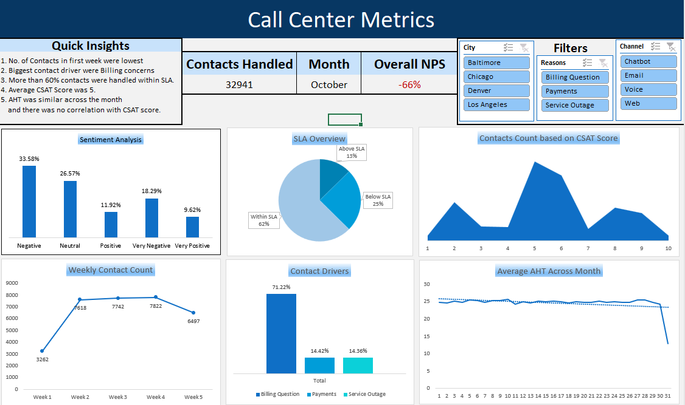

# Call-Center-Analysis
Steps taken while Analysing data Using Excel
- Renamed the customer city/state headers
- Added column for Call center state using text to column and renamed
- Checked Duplicates and blanks
- No Duplicates found
- Cleaned the date format from string to date
- Filled the blanks in CSAT-Score using average of senitment score
- Created new column for weeks and Days of month.
- Finally Created dashboard using Pivot tables and various analysis

Final Dashboard:

